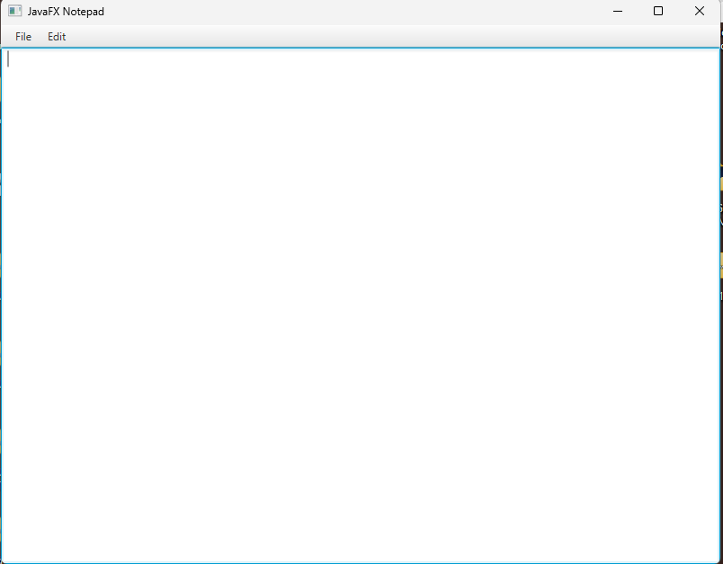

# JavaFX Notepad Application

A simple Notepad application built using JavaFX.  
This project demonstrates GUI development, menu handling, and file operations in Java.

---

## Features

- Create new text files
- Open existing files
- Save files
- Save As functionality
- Cut, Copy, and Paste
- JavaFX graphical user interface

---

## Technologies Used

- Java
- JavaFx
- VS Code 
- File Handling (`java.io`)

---

## Requirements

Before running the project, install:

- JDK 17 or higher
- JavaFX SDK 17

Download JavaFX SDK from:

https://gluonhq.com/products/javafx/

---

## VS Code Configuration

Create a file named:

```text
.vscode/settings.json
```

Add the following:

```json
{
  "java.project.referencedLibraries": [
    "javafx-sdk-17.0.1/lib/*.jar"
  ]
}
```

---

## How to Compile and Run

### Step 1: Open terminal inside the project folder

Navigate to the `src` folder:

```powershell
cd src
```

---

### Step 2: Compile the program

```powershell
javac --module-path "../javafx-sdk-17.0.1/lib" --add-modules javafx.controls App.java
```

---

### Step 3: Run the program

```powershell
java --module-path "../javafx-sdk-17.0.1/lib" --add-modules javafx.controls App
```

---

## Application Preview

The application includes:

- File Menu
  - New
  - Open
  - Save
  - Save As
  - Exit

- Edit Menu
  - Cut
  - Copy
  - Paste

---

## Screenshot



---

## Learning Objectives

This project helps understand:

- JavaFX GUI development
- Event handling
- File input/output
- Java classes and methods
- Menu and layout management

---

## Author

**Soliyana Kibrom**

---
